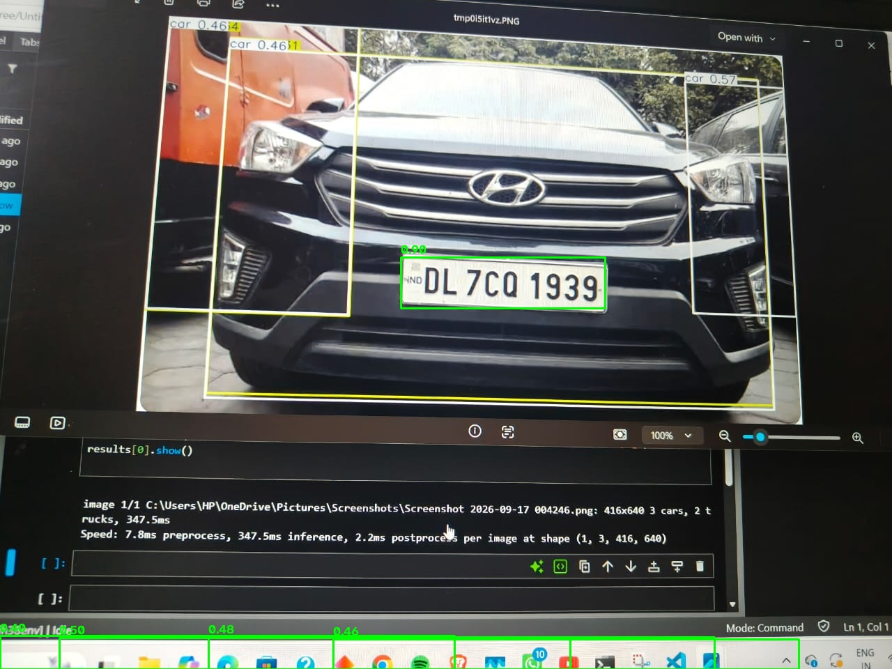

# License Plate Detection with YOLOv8

A fine-tuned YOLOv8 model that detects vehicle number plates in images and video frames, returning a bounding box and a cropped plate image for each detection.

Built as the plate-detection module of our Smart India Hackathon 2026 project (problem statement SIH26127: multi-camera ANPR and urban traffic analytics), developed by a 6-member team.



## Training details

- Model: YOLOv8, fine-tuned from COCO pretrained weights
- Dataset: approximately 3,000 license-plate images in YOLO format
- Training: 50 epochs on Google Colab with a GPU
- The model detects only the number plate, not the whole vehicle
- Validation (580 images): on the `numberplate` class, which makes up 593 of 602 instances, precision 0.99, recall 0.877, mAP50 0.979, mAP50-95 0.838
- The dataset also contains a rare second class, `Licence-Plates` (9 instances), which lowers the overall mAP50 across both classes to 0.678

## Workflow

### 1. Environment setup

```bash
pip install -r requirements.txt
```

This installs `ultralytics` (YOLOv8), `opencv-python` and `numpy`. Ultralytics downloads the base `yolov8n.pt` (COCO weights) automatically on first use. It has never seen a license plate, so it won't detect any yet, but running it proves the pipeline works end to end.

### 2. Get a plate dataset

Roboflow Universe has several single-class license-plate datasets in YOLOv8 format. On a dataset page, choose **Download Dataset**, pick the **YOLOv8** format, and you get `images/`, `labels/` and a `data.yaml`. See `plates.yaml.example` for what the config should look like.

### 3. Test the pipeline with pretrained weights

```bash
python detect_plates.py sample.jpeg yolov8n.pt
```

This only confirms that Ultralytics, OpenCV and your install work.

### 4. Fine-tune on the plate dataset

```bash
python train_plate_model.py --data plates.yaml --epochs 50
```

- Start with `yolov8n` (nano). It trains fast and is accurate enough for a single-class problem.
- Early stopping (`patience=15`) ends training if it plateaus.
- Best weights are saved at `runs/detect/train/weights/best.pt`. A trained copy is included in this repo as `best.pt`.
- No local GPU? Google Colab's free T4 GPU is enough for a dataset this size.

### 5. Run detection with the trained model

```bash
python detect_plates.py sample.jpeg best.pt
```

On video, extract frames and run detection on each:

```python
from detect_plates import extract_frames, load_model, detect_plates

frames = extract_frames("traffic_sample.mp4", "frames/", every_n_seconds=1.5)
model = load_model("best.pt")

for frame_path in frames:
    dets = detect_plates(frame_path, model)
    # each detection has a bounding box, confidence and a cropped plate image
```

### 6. Tuning tips

- False positives on things that aren't plates: raise `conf_threshold` in `detect_plates()` (try 0.45-0.5).
- Missing small or distant plates: lower it (0.2-0.25) and/or train with a larger `imgsz` (such as 960 instead of 640). This costs more training time but helps with small objects.
- Keep annotated outputs like `detections_preview.jpg` as you go, useful for debugging and for presentations.

## Files

| File | Purpose |
|---|---|
| `detect_plates.py` | Core module: detect plates, draw boxes, extract video frames |
| `train_plate_model.py` | Fine-tunes YOLOv8 on a plate dataset |
| `plates.yaml.example` | Example dataset config |
| `requirements.txt` | Python dependencies |
| `best.pt` | Trained plate-detection weights |
| Other `.py` scripts | Experiments with batch detection, plate cropping, and vehicle tracking and counting on video |

## Notes

- Each detection includes a crop of the plate, meant to be passed to an OCR stage (handled separately by a teammate).